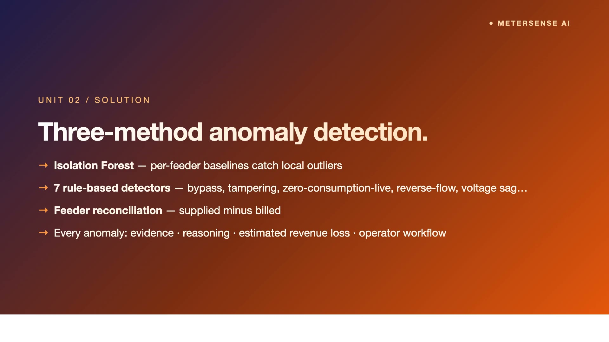
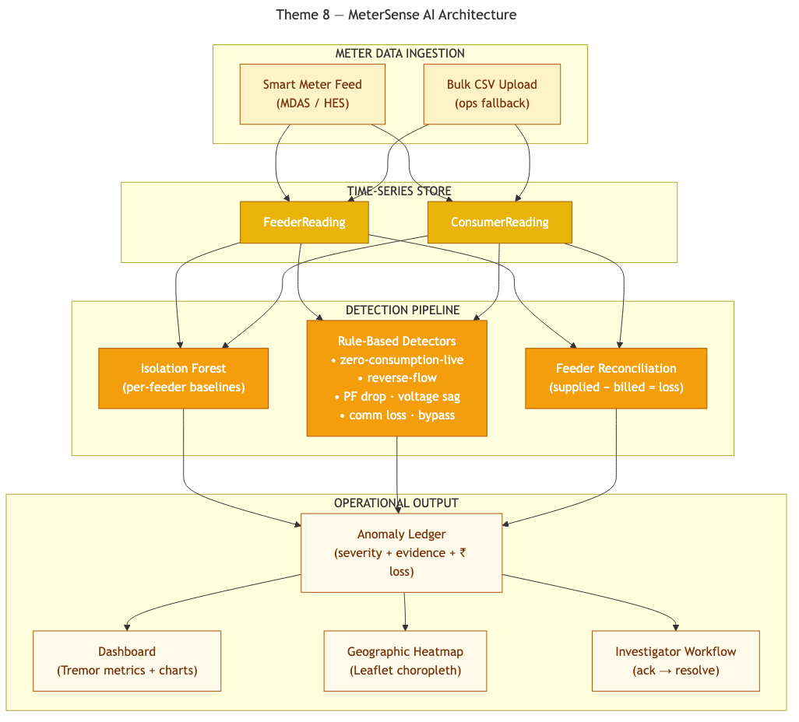

# MeterSense AI — BESCOM Smart Meter Intelligence + Loss Detection

> **PanIIT AI for Bharat 2026 — Theme 8** · **Sponsor:** BESCOM
> Forecast · Detect · Recover

[](https://github.com/sridhar7601/bescom-meter-intel/blob/main/demo/video/demo.mp4)

▶ **[Watch the 5-minute demo](https://github.com/sridhar7601/bescom-meter-intel/blob/main/demo/video/demo.mp4)**

---

## What it solves

BESCOM has rolled out millions of smart meters but the data lake is mostly dormant. **Two problems sit on top of it.** First — feeder demand forecasting is still substation-aggregate; localized risk gets averaged out. Second — AT&C losses run 12–15%, and detection today is mostly bill-vs-supply reconciliation done monthly. Smart meters give us hourly granularity; we should be using it.

## Key features

- **Part A — 24h hourly forecast per feeder** — Seasonal-naive (4-week lookback at same dayOfWeek+hour) × recent trend correction
- **High-risk classification** — Feeders forecast to exceed 130% of historical mean → HIGH risk
- **Confidence band** — ±1.96σ from seasonal samples (honest uncertainty, not false precision)
- **Baseline comparison** — Back-tested against historical-average + persistence baselines (brief criterion)
- **Part B — Isolation forest** — Per-feeder cohort with 6-dim feature vector + severity tiers (CRITICAL / HIGH / MEDIUM)
- **6 explicit rule detectors** — ZERO_CONSUMPTION_LIVE · REVERSE_FLOW · POWER_FACTOR_DROP · VOLTAGE_SAG · METER_COMM_LOSS · TAMPER_SUSPECTED
- **Feeder reconciliation** — kWh supplied vs Σ billed; bypass flagged at >25% loss + <50% active meters
- **5-state investigation workflow** — OPEN → ACKNOWLEDGED → INVESTIGATING → RESOLVED / FALSE_POSITIVE
- **Grounded AI narration** — GPT-4.1 only describes detector + severity output; cannot change the verdict

## Architecture



> Source: [`docs/diagrams/architecture.mmd`](docs/diagrams/architecture.mmd) (Mermaid)

## Quick start

### Prerequisites

| Tool | Version |
|------|---------|
| Node.js | 18+ |
| npm | 9+ |

> No Python. No Docker. SQLite is bundled.

### Setup

```bash
# 1. Install
npm install

# 2. Configure environment (optional — without keys, AI falls back to deterministic templates)
cat > .env.local <<'EOF'
AZURE_OPENAI_API_KEY=your_key
AZURE_OPENAI_ENDPOINT=https://<resource>.openai.azure.com/openai/deployments/<deployment>/chat/completions?api-version=2025-01-01-preview
EOF

# 3. Set up the database
npx prisma generate
npx prisma migrate dev --name init

# 4. Seed demo data
npm run seed

# 5. Run the dev server
npm run dev
```

Open <http://localhost:3000>.

### One-liner

```bash
npm install && npx prisma generate && npx prisma migrate dev --name init && npm run seed && npm run dev
```


## Demo flow

1. Land on `/` for the BESCOM ops console — feeders / anomalies open / MW forecast / loss rate
2. `/map` — Bengaluru-wide feeder pins coloured by current risk
3. `/forecasting` — Part A. 24h hourly per feeder with confidence bands + baseline comparison
4. `/anomalies` — Part B. Severity tiers + 6 rule detectors. Click into a CRITICAL.
5. `/anomalies/<id>` — feeder ID + detector + time-series evidence + AI explanation + 5-state workflow
6. `/substations/<id>` — kWh supplied vs Σ billed (bypass flagged at >25% loss + <50% active meters)

> **Demo data:** Multiple substations across Bengaluru divisions · dozens of feeders · hundreds of consumers · anomalies at every severity tier · all 6 rule detectors firing on real synthetic patterns · Faker seed=42

## Tech stack

| Layer | Technology |
|-------|------------|
| Framework | Next.js 16 (App Router, TypeScript) |
| Database | Prisma + SQLite (PostgreSQL-portable in production) |
| Detection | Isolation forest + 6 deterministic rule detectors |
| Map | Leaflet + react-leaflet |
| AI / LLM | Azure OpenAI GPT-4.1 with deterministic mock fallback (`lib/llm-narration.ts` model-agnostic) |
| Styling | Tailwind CSS + Tremor charts |

## Brief non-negotiables met

- ✅ Synthetic data only
- ✅ No hosted-LLM on real meter data (production swaps for on-prem Llama-3 / Mistral)
- ✅ Deterministic explainable detection (rules + isolation forest, not a black box)
- ✅ Decision-support layer (no system writes)

---

## Submission

- **Hackathon:** PanIIT AI for Bharat 2026
- **Theme:** 8 — BESCOM Smart Meter Intelligence + Loss Detection
- **Video:** https://github.com/sridhar7601/bescom-meter-intel/blob/main/demo/video/demo.mp4
- **Repo:** https://github.com/sridhar7601/bescom-meter-intel
- **Team:** Sridhar Suresh, Sruthi Krishnakumar
